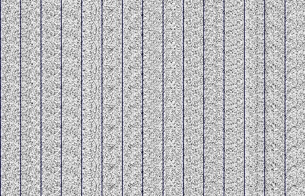
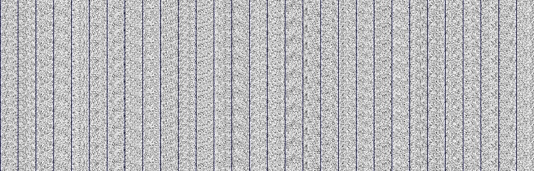

# patternizer
____________

## Introduction

Hey y'all, so this is my repo for learning about machine learning. Everything is written in c++ using only the standard
library. I know, I know, there are fast libraries out there, but the point of this exercise was not to build something
as fast as possible, but rather to learn, and what better way than to do it from scratch? With that in mind, there are
additional classes associated with each of the machine learning types for support.

With that jargon out of the way, here is a current list of machine learning things I have built.

1. <a href="#perceptron">Perceptron</a>
2. <a href="#simpleNN">Simple Neural Network</a> (Basic cost function, 1 hidden layer, prebuilt to read MNIST data).
3. <a href="#modularNN">Modular Neural Network</a>
4. <a href="#future"> Future </a>

As I continue teaching myself, this list will grow, so enjoy!

__________
## <a id="perceptron">Perceptron</a>

### Introduction
Being the among the oldest flavors of machine learning, I've implemented one of my one.
It works like you'd expect. Train it by giving an input and a target output, and it will adjust its
weight until it gets where it should be.

In main.cpp, there is a function demonstrating how the class works called perceptronDemo.

### Conclusions
Perceptrons are limited in that they cannot model things much better than linearly (so XOR is out of the question).
However, the way that they update their weights and biases is very similar to how things work in other network types,
so it is a really good place to start learning the basic principles.

_____________________

## <a id="simpleNN">Simple Neural Network</a>

### Introduction
Moving up the chain, I've implemented a simple neural network. It uses the Quadratic Cost Function ((target - output)^2)/2,
allows you to define a learning rate, and to define the number of inputs, hidden layer neurons, and outputs. It's pretty slick...
I've managed to get over 90% accuracy on the MNIST set within 30 training epochs.

In order to make this work, I've created a Matrix library. Unfortunately, it does not use the hardware to speed things up (GPU anyone?),
but that may come with time. Also, there is a class to convert the MNIST data from big to little endian and store it.

In main.cpp, you will find main.cpp implementing, training, and testing a SimpleNeuralNetwork instance.

### Conclusions
Though simple, this network has been absolutely incredible in learning the basics of machine learning.

Some notable things: As long as the activation function is non-linear, this process has the ability to model any function.
The difference between a shallow and deep network is the number of hidden layers (shallow has 1, deep > 1). One of the major problems
with deep neural networks is something called the vanishing gradient... the error backpropagated essentially doesn't touch earlier layers,
meaning only the last layer is doing any major learning. I saw this while building out a shallow network before making my weights
Gaussian distributed.

Fast overview of how it works:

1. Weights and biases initialized in a Gaussian distribution with a standard deviation of 0.333 and mean of 0.

2. Activation function is chosen

3. Cost function is chosen

4. Data is fed forward the network. The activation function at each layer processes the input from the previous input,
using both the weights and biases to modify the input a bit.

5. The error in the final layer is calculated by taking the gradient of the cost function in terms of the activation function.

6. The error is backpropagated through the system (find out the error from each weight and bias in each layer in terms of
the activation function)

7. Update the weights and biases according to the error in each layer scaled down with a learning rate.

8. Repeat.

Another interesting finding is with visualizing how the weights are working. I included the ability to write the weights at
a given point to an image representation. Look at the two images below:
 
They both are Neural Networks analyzing the MNIST data set. One had 15 layers, and the other 30. The two images are remarkably
similar for the first 15 columns, suggesting that the addition of neurons looks for additional features. There may be a
redistribution of features, but that will become clear only with additional testing.

_____________________

## <a id="modularNN">Modular Neural Network</a>

### Introduction

There are a few differences between this and the previous neural network. The biggest aspect is that this is very modular.
A NNLayer struct was defined which allows traits to be defined by the user. An activation function class was defined to provide
many different types of functions to explore, but becuase the struct can use any function and it's derivative, you
are not limited. Minor fixes to the algorithm lead to a huge performance boost. With 60 hidden neurons, I was able to reach
96% accuracy in less than 10 training epochs. Finally, this network can be used for both shallow and deep networks.

### Things to add:

1. Regularization techniques
2. Choosing cost functions
3. Weight initialization options

### Things to explore:

1. Network of small shallow networks vs one large shallow network
2. Which activation function works the best?
3. Which activation function combination works the best?
4. Vanishing Gradient

______
## <a id="future">Future</a>

The next step will be making the "Simple" Neural Network more complex. This includes adding regularization techniques,
having the option of different cost functions including the cross-entropy cost function, and adding momentum to the gradient
descent.

Once these additional things are added, I believe I will be home free to continue onwards to a "deep" Network.

Other areas to be pursued:

**Genetic algorithms** -- Finds probable optimizations on weird data sets
                   (Most value if can take 1 pound, 500 different things with different weights and values...)

**Reinforcement Learning** -- Agents learn in environment meaning you don't need initial training data

**Generative Learning** -- The ability to "copy". Given a bunch of hand written 5's, output your own 5.

**Networks with Memory** -- Traditional NN "forgets" previous learning when switched to a new task. Can you stop that?
                     This includes: long-short term memory networks, elastic weight consolidation, and progressive neural networks

**Less Data, Smaller Models** -- Can simpler NN's learn from complex ones to reduce the training time? Transfer training...

**Environment Creation** -- We can't really just let a robot ai run wild... create a virtual environment and have ai learn there...

